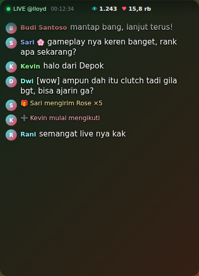

<div align="center">

# 🎬 TikTok Live Overlay

**Overlay komentar TikTok LIVE yang ringan, transparan, tidak mengganggu, dan bisa membacakan komentar (TTS).**


Dibuat oleh **Lloyd Von Degurechaff**

</div>

---

## Tentang aplikasi

TikTok Live Overlay membantu streamer membaca aktivitas TikTok LIVE tanpa harus terus membuka jendela TikTok. Overlay ditempatkan di atas game, OBS, browser, atau aplikasi lain, dan bisa membacakan komentar penonton dengan suara.

Aplikasi membaca aktivitas dari LIVE publik secara real-time dan tidak memerlukan password akun TikTok.



## ✨ Fitur

**Komentar & aktivitas**
- 💬 Komentar LIVE real-time, satu baris per komentar dengan nama berwarna
- 👁️ Jumlah penonton aktif dan ❤️ total like
- 🎁 Notifikasi gift (termasuk combo), 🔗 share, dan ➕ follow
- 👋 Notifikasi penonton bergabung dan 🏆 top viewers (opsional, default mati)

**Musik request (`!play`)**
- 🎵 Penonton ketik `!play judul lagu` (contoh `!play pure`), lagu yang cocok langsung dicari dan diputar
- Kartu "Now playing" bergaya Spotify/YouTube Music: cover, judul, artis, pemesan, progress bar, dan antrean berikutnya
- Host dan moderator: `!skip` (lewati) dan `!pause` (jeda; ketik lagi untuk lanjut)
- Halaman playlist terpisah untuk sumber Browser/Link di OBS atau TikTok LIVE Studio: link lokal, link publik `https://` (Cloudflare), atau jendela khusus untuk Window Capture
- Perlindungan spam: jeda 20 detik per penonton, maksimal 2 lagu per penonton, antrean maksimal 10, durasi maksimal 10 menit
- Musik otomatis dikecilkan saat TTS membacakan komentar; perintah tidak ikut dibacakan

**Tampilan yang tidak mengganggu**
- Bar atas ramping; tombol dan footer hanya muncul saat kursor di atas overlay
- Latar belakang bisa diatur sampai transparan penuh (teks tetap terbaca)
- Chat lama memudar otomatis (waktu bisa diatur atau dimatikan)
- Tanpa efek blur sehingga ringan untuk GPU saat bermain game
- Muncul tanpa merebut fokus dari game
- Pengaturan tampilan tersimpan otomatis

**Kontrol jendela**
- 📌 Selalu di atas aplikasi lain
- 🖱️ Mode klik-tembus untuk dipakai di atas game
- 📐 Ukuran Kecil / Sedang / Besar

**Pembaca komentar (TTS)**
- 🔊 Suara neural Microsoft Edge: gratis, tanpa API key
- 🔇 Tombol bisu cepat `Ctrl` + `Shift` + `M` dari aplikasi mana pun
- 🛡️ Menyaring link, kata terlarang, komentar ganda, komentar terlalu panjang, dan kode emote
- ⏱️ Komentar yang antri terlalu lama otomatis dilewati supaya suara tidak ketinggalan

**Stabilitas**
- 🔄 Auto-reconnect saat koneksi putus (sampai 8 kali, jeda bertahap)
- 🔒 Hanya satu overlay yang bisa berjalan pada satu waktu
- 🧯 Klik **Hubungkan** berulang kali tidak lagi meninggalkan koneksi yatim atau menimpa status baru
- 📈 Angka viewer dan like tidak lagi tiba-tiba jadi 0 bila TikTok tidak mengirim datanya; counter direset tiap sesi baru

**Koneksi yang tangguh (baru)**
- 🌐 Semua permintaan ke TikTok dipaksa lewat `https://` (library bawaan memakai `http://` port 80 yang diputus di sebagian jaringan)
- 🧭 Pesan error menampilkan **kode error asli** (`ECONNREFUSED`, `ENOTFOUND`, `ETIMEDOUT`, sertifikat, 403) beserta saran dalam bahasa Indonesia
- 🩺 **Diagnosa otomatis** saat koneksi gagal: cek DNS, TCP, HTTPS, dan jalur Chromium, lalu tampilkan kesimpulan
- 🛟 **DNS alternatif otomatis** (DNS-over-HTTPS Cloudflare/Google) bila DNS provider memberi IP yang tidak bisa dihubungi
- 🔀 **Proxy otomatis**: memakai proxy sistem Windows (termasuk PAC), `TIKTOK_PROXY`, atau `HTTPS_PROXY`
- 🔑 Kolom opsional **API key Euler Stream** untuk jalur cadangan pencarian Room ID
- ⏳ Batas waktu permintaan 30 detik (bawaan library 10 detik) dan batas waktu keras 35 detik agar tidak menggantung

## 🚀 Menjalankan

### Persyaratan

- Windows 10 atau 11
- [Node.js](https://nodejs.org/) 20 atau lebih baru

### Dari source code

```powershell
git clone https://github.com/lloyddevile/tiktoklive-overlay.git
cd tiktoklive-overlay
npm install
npm start
```

Atau klik dua kali `Jalankan.cmd`. Script itu memasang dependensi otomatis jika belum ada.

### Membuat EXE portable

```powershell
npm install
npm run pack
```

Hasilnya ada di `dist/TikTok Live Overlay 2.7.0.exe` dan tidak perlu instalasi.

### Cara pakai

1. Masukkan username host (contoh `username`) atau tempel link TikTok LIVE.
2. Klik **Hubungkan**. Akun harus sedang LIVE dan siarannya publik.
3. Klik ⚙ untuk mengatur tampilan dan menyalakan **Bacakan komentar**.
4. Jika gagal terhubung, baca bagian **Diagnosa** di pesan error (lihat [Gagal terhubung](#gagal-terhubung-room-id-tidak-ditemukan)).

### Opsi koneksi

| Opsi | Fungsi |
|---|---|
| Kolom **API key Euler Stream** (di bawah username) | Jalur cadangan pencarian Room ID. Key gratis di [eulerstream.com](https://www.eulerstream.com); tersimpan setelah sekali diisi |
| `set EULER_API_KEY=xxxx` sebelum `npm start` | Memberi API key lewat environment variable |
| `set TIKTOK_PROXY=http://host:port` | Memakai proxy HTTP tertentu (tanpa ini, proxy sistem Windows dipakai otomatis; SOCKS belum didukung) |
| `set TIKTOK_CLIENT_TIMEOUT=45000` | Mengubah batas waktu permintaan (ms) |
| `Tes-Koneksi.cmd` | Diagnosa jaringan ke TikTok, Euler Stream, dan Google; kirim hasilnya bila perlu bantuan |

## 🎵 Musik request (`!play`)

| Perintah | Siapa | Fungsi |
|---|---|---|
| `!play judul lagu` | Semua penonton | Mencari dan menambahkan lagu ke antrean (langsung diputar bila antrean kosong) |
| `!skip` | Host dan moderator | Lewati lagu yang sedang diputar |
| `!pause` | Host dan moderator | Jeda; ketik lagi untuk melanjutkan (`!resume` juga bisa) |

Host adalah akun yang sedang Anda hubungkan; moderator dikenali dari lencana moderator TikTok. Daftar akun tambahan bisa diisi di `options.admins` (lihat `src/music.js`).

### Prioritas gift

Penonton yang mengirim gift lagunya naik ke depan antrean (selalu **setelah** lagu yang sedang diputar; lagu yang sedang berjalan tidak pernah dipotong).

| Aturan | Penjelasan |
|---|---|
| **Gift lebih besar = lebih atas** | Nilai gift dihitung dalam koin (koin per gift × jumlah). Total koin terbesar berada di paling atas |
| **Urutan gift tidak penting** | Gift sebelum atau sesudah `!play` sama saja. Bila lagu sudah antre lalu pemiliknya gift, lagunya langsung naik |
| **Nilai sama: yang lebih dulu tetap di atas** | Agus kirim Rose, lalu Asep kirim Rose: Agus tetap #1. Asep baru menyalip bila totalnya lebih besar, dan Agus bisa menyalip balik dengan gift tambahan |
| **Tanpa gift** | Urutan request biasa (siapa dulu, dia dulu) |
| **Kredit habis saat lagu diputar** | Setelah lagu pemberi gift mulai diputar, kreditnya dipakai; request berikutnya perlu gift lagi. Untuk membuat gift menumpuk selama sesi LIVE (tidak habis), jalankan dengan `set GIFT_CONSUME=0` sebelum `npm start` |
| **Reset tiap sesi** | Kredit gift dikosongkan saat menghubungkan LIVE baru |

Lagu berprioritas ditandai 🎁 di daftar antrean (overlay dan halaman playlist) dan muncul notifikasi kuning di chat. Gift beruntun (combo) dihitung sekali di akhir streak.

### Halaman playlist untuk OBS / TikTok LIVE Studio

Saat aplikasi berjalan, tersedia halaman khusus playlist (tampilan saja, tanpa suara, latar transparan):

```text
http://localhost:3100/playlist
```

Link yang tepat tertera di ⚙ Pengaturan → **Link playlist** (tombol **Salin**). Jika port 3100 terpakai, aplikasi otomatis memakai 3101 dan seterusnya.

| Aplikasi | Cara menambahkan |
|---|---|
| **OBS Studio** | Sources → **+** → **Browser** → tempel URL, lebar 420, tinggi 420 (atau sesuai selera) |
| **TikTok LIVE Studio** | Tambah sumber → **Link** (Web page) → tempel URL |

#### Jika OBS / TikTok LIVE Studio menolak link `localhost`

Ada tiga cara, berurutan dari yang paling mudah. Semuanya ada di ⚙ Pengaturan → **Link playlist**:

| Cara | Langkah | Catatan |
|---|---|---|
| **1. Ganti alamat** | Pilih **Lokal: 127.0.0.1** (bukan `localhost`) lalu salin | Server melayani `127.0.0.1` dan `::1` (IPv6) sekaligus, jadi aplikasi yang menerjemahkan `localhost` ke IPv6 tetap tersambung |
| **2. Link publik `https://`** | Pilih **Publik: https (Cloudflare)**, tunggu link muncul (sampai 1 menit), klik **Salin**, tempel di sumber **Link** | Memakai Cloudflare Quick Tunnel (gratis, tanpa akun). Link berbentuk `https://xxxx.trycloudflare.com/t/<kunci>/playlist`; kunci acak berubah setiap aplikasi dijalankan, dan permintaan lewat tunnel tanpa kunci ditolak. Tunnel mati saat aplikasi ditutup, dan link baru dibuat saat dijalankan lagi, jadi tempel ulang di LIVE Studio. Butuh internet yang tidak memblokir Cloudflare |
| **3. Jendela playlist + Window Capture** | Pilih latar **Hijau (chroma key)** atau **Gelap**, klik **Buka**, lalu tambah sumber **Window Capture** (OBS) / **Window** (LIVE Studio) yang menunjuk jendela "Playlist TikTok Live Overlay". Untuk latar hijau, pasang filter **Chroma Key** | Tidak perlu internet sama sekali. Jangan di-minimize (jendela yang diperkecil tidak tertangkap); boleh ditaruh di balik jendela lain atau di monitor kedua |

Link publik memakai pembaruan berkala (polling), bukan SSE, karena Cloudflare Quick Tunnel tidak mendukung SSE. Pada koneksi lokal, halaman otomatis beralih ke polling bila SSE tidak mengirim data dalam 4 detik. Gunakan `?poll=1` untuk memaksanya.

Opsi tambahan di akhir URL (gabungkan dengan `&`):

| Opsi | Fungsi | Contoh |
|---|---|---|
| `max` | Jumlah lagu "Berikutnya" yang ditampilkan (0 = sembunyikan) | `?max=4` |
| `idle=0` | Halaman kosong saat tidak ada lagu (tanpa kartu petunjuk) | `?idle=0` |
| `hint=0` | Sembunyikan teks "Ketik !play judul lagu" | `?hint=0` |
| `scale` | Perbesar/perkecil seluruh tampilan | `?scale=1.2` |
| `bg` | Warna latar (hex 6 digit), mis. hijau untuk chroma key | `?bg=00ff00` |
| `poll=1` | Paksa pembaruan berkala (otomatis di link `trycloudflare.com`) | `?poll=1` |

Contoh: `http://localhost:3100/playlist?max=4&hint=0&scale=1.2`.

Catatan: suara lagu tetap diputar dari aplikasi overlay (lewat speaker/perangkat audio utama), bukan dari halaman playlist, jadi tidak ada suara ganda. Kartu "Now playing" di overlay bisa disembunyikan lewat ⚙ → **Kartu di overlay ini** bila Anda hanya ingin menampilkannya lewat OBS. Server lokal hanya menerima koneksi dari PC Anda sendiri (127.0.0.1 dan ::1), hanya melayani GET, dan tidak bisa mengubah apa pun. Akses publik hanya terbuka bila Anda memilih link publik.

### Lagu penuh vs pratinjau 30 detik

- **Tanpa instalasi apa pun**, aplikasi memakai pratinjau 30 detik dari iTunes Search API (kartu diberi tanda `PRATINJAU 30 DTK`).
- **Untuk lagu penuh**, pasang [yt-dlp](https://github.com/yt-dlp/yt-dlp): unduh `yt-dlp.exe` dan letakkan di folder aplikasi (sebelah `package.json`, atau sebelah file EXE portable), atau pasang lewat `winget install yt-dlp` agar ada di PATH. Atau isi variabel lingkungan `YTDLP_PATH`. Perbarui secara berkala dengan `yt-dlp -U` karena YouTube sering berubah.
- Pengaturan musik (nyala/mati, volume, antrean, kecilkan saat TTS) ada di ⚙ Pengaturan.

> **Perhatian hak cipta:** memutar musik berhak cipta di LIVE bisa membuat TikTok membisukan siaran atau memberi peringatan. Gunakan musik bebas royalti atau yang Anda punya izinnya.

## 🔊 Pembaca komentar (TTS)

Buka **⚙ Pengaturan**, lalu aktifkan **Bacakan komentar**.

- Pilih suara: Ardi (pria), Gadis (wanita), English Aria, atau Melayu Yasmin
- Atur kecepatan dan volume; opsi **Sebut nama** membacakan nama pengirim
- **Tes** untuk uji suara, **Lewati** untuk membuang antrean
- Komentar lama yang dikirim saat baru terhubung tidak dibacakan
- Butuh koneksi internet; pengaturan tersimpan otomatis

Daftar kata terlarang, batas panjang, dan ukuran antrean bisa diubah di objek `cfg` pada bagian atas `src/tts.js`.

## 🎮 Kontrol

| Kontrol | Fungsi |
|---|---|
| Tarik bar atas | Memindahkan overlay |
| Preset Kecil / Sedang / Besar | Mengubah ukuran jendela |
| Selalu di atas | Menjaga overlay di atas aplikasi lain |
| Klik tembus | Meneruskan klik ke aplikasi di belakang overlay |
| `Ctrl` + `Shift` + `X` | Menyalakan/mematikan klik-tembus dari aplikasi mana pun |
| `Ctrl` + `Shift` + `M` | Membisukan/mengaktifkan suara TTS (jika TTS aktif) |

> **Penting:** jika overlay tidak bisa diklik karena klik-tembus aktif, tekan `Ctrl` + `Shift` + `X`.

## 📱 Versi Termux (Android)

Versi tanpa Electron ada di folder [`termux/`](termux/README.md): tampilan lewat browser HP dan suara neural Edge yang diputar di browser (dengan beberapa mesin cadangan: suara bawaan perangkat, Termux:API media player, `termux-tts-speak`). Versi ini tidak bisa menjadi overlay di atas game. Perbaikan koneksi (HTTPS, diagnosa, DNS alternatif, proxy, API key) juga ada di versi ini.

## 📁 Struktur proyek

```text
.
├── src/
│   ├── main.js         # Window Electron, koneksi TikTok LIVE, sintesis suara
│   ├── preload.cjs     # Jembatan IPC yang aman
│   ├── renderer.js     # Logika antarmuka overlay
│   ├── netfix.js       # Diagnosa jaringan, DNS-over-HTTPS, agent DNS alternatif
│   ├── tts.js          # Pembaca komentar (antrean, filter, pemutar audio)
│   ├── music.js        # Logika !play/!skip/!pause (antrean, pencarian yt-dlp/iTunes)
│   ├── player.js       # Pemutar musik + kartu Now playing
│   ├── player.css      # Gaya kartu Now playing
│   ├── web-server.js   # Server lokal halaman playlist (127.0.0.1 dan ::1, port 3100)
│   ├── tunnel.js       # Link publik https lewat Cloudflare Quick Tunnel
│   ├── web/            # Halaman playlist (playlist.html/.css/.js)
│   ├── index.html      # Struktur tampilan
│   ├── styles.css      # Tampilan utama
│   └── controls.css    # Panel pengaturan
├── termux/             # Versi Termux/Android (server Node + halaman web)
├── docs/Screenshot.png
├── Jalankan.cmd        # Menjalankan aplikasi di Windows
├── Tes-Koneksi.cmd     # Diagnosa jaringan (memanggil tes-koneksi.mjs)
├── tes-koneksi.mjs     # Skrip diagnosa DNS/TCP/TLS/HTTPS
└── package.json
```

## ❓ Pemecahan masalah

### Gagal terhubung: "Room ID tidak ditemukan"

Artinya TikTok tidak mengembalikan Room ID lewat ketiga jalur yang dicoba library. Pesan error sekarang memuat bagian **Detail** (kode error tiap jalur) dan **Diagnosa** (kesimpulan otomatis). Cocokkan dengan tabel ini:

| Yang tampil | Arti | Yang dilakukan |
|---|---|---|
| `[ENOTFOUND]` / DNS gagal | DNS provider tidak menemukan tiktok.com | Ganti DNS Windows ke `1.1.1.1` atau `8.8.8.8` (aplikasi juga mencoba DNS alternatif otomatis) |
| `[ECONNREFUSED]` / `[ECONNRESET]` | Koneksi ditolak/diputus | Cek VPN/proxy, antivirus, firewall; coba tethering HP atau jaringan lain |
| `[ETIMEDOUT]` / "Timeout awaiting" | Paket ke TikTok tertahan | Biasanya filter provider atau antivirus (scan HTTPS). Coba VPN mode seluruh sistem atau jaringan lain |
| Sertifikat HTTPS ditolak | Antivirus mencegat HTTPS | Matikan fitur scan HTTPS dan pastikan jam & tanggal PC benar |
| `403` | TikTok menolak IP ini | Matikan VPN datacenter, ganti jaringan, atau isi API key Euler Stream |
| "Jalur browser berhasil, Node tidak" | Browser kamu memakai VPN/proxy yang tidak dipakai aplikasi | Aktifkan VPN mode seluruh sistem, atau atur `TIKTOK_PROXY` |
| Jaringan normal | Akun tidak LIVE atau username salah | Cek akun dan pastikan LIVE publik |

> **Catatan Node 24.20+ / Electron 44.2+:** library HTTP `got` menyembunyikan semua error koneksi di balik pesan generik *"Socket closed before the connection was established"*. Aplikasi ini sudah mematikan retry `got` agar kode error aslinya terlihat.

Jalankan `Tes-Koneksi.cmd` untuk pengecekan jaringan mandiri.

**Komentar tidak muncul**
- Pastikan username benar, akun sedang LIVE, dan LIVE bersifat publik.
- Tunggu beberapa detik setelah status menjadi terhubung.
- Putuskan lalu hubungkan kembali jika jaringan sempat terputus.

**Jumlah penonton masih `—`**
Angka diperbarui saat TikTok mengirim event statistik `ROOM_USER`. Snapshot pertama bisa butuh beberapa detik.

**Overlay tidak bisa diklik**
Klik-tembus sedang aktif. Tekan `Ctrl` + `Shift` + `X`.

**Suara tidak keluar**
Pastikan internet aktif, volume suara tidak 0, dan tombol 🔊 tidak dalam keadaan bisu. Pesan error muncul di bawah pengaturan suara.

**Windows menampilkan peringatan keamanan**
Build lokal belum memiliki sertifikat code-signing. Periksa source code dan build sendiri jika ingin memastikan isinya.

## ⚠️ Catatan dan disclaimer

Proyek ini memakai [`tiktok-live-connector`](https://www.npmjs.com/package/tiktok-live-connector), library tidak resmi yang membaca event webcast TikTok LIVE publik.

Proyek ini:

- tidak berafiliasi, disponsori, atau didukung oleh TikTok maupun ByteDance;
- tidak meminta password TikTok;
- hanya ditujukan untuk membaca aktivitas LIVE yang dapat diakses publik;
- dapat berhenti bekerja jika TikTok mengubah endpoint, format event, atau kebijakan aksesnya.

Gunakan secara bertanggung jawab dan patuhi ketentuan platform yang berlaku.

## 🧭 Ide pengembangan berikutnya

- Prefetch suara komentar berikutnya agar tidak ada jeda antar komentar
- Filter komentar: hanya baca yang diawali `!` atau dari follower, dengan daftar kata terlarang yang bisa diedit dari UI
- Perintah chat tambahan seperti `!rank` dan `!sosmed` dengan balasan otomatis
- Perintah musik tambahan: `!queue` (lihat antrean), `!volume`, dan voting skip oleh penonton
- Nada TTS berbeda untuk gift dan follow
- Pilihan perangkat audio keluaran khusus TTS (memudahkan pemisahan di OBS)
- Mode OBS Browser Source: server lokal yang menampilkan chat yang sama sebagai halaman web
- Simpan log chat dan statistik live ke file setelah sesi selesai
- Dukungan proxy SOCKS

## 📝 Riwayat perubahan

### v2.7.0
- Prioritas gift untuk antrean `!play`: total koin gift terbesar di paling atas, gift boleh sebelum atau sesudah request, nilai sama dipecah dengan siapa yang lebih dulu mencapainya (tidak lagi saling menurunkan), kredit habis saat lagu diputar dan reset tiap sesi LIVE
- Penanda 🎁 di antrean dan notifikasi kuning saat lagu naik; berlaku juga di versi Termux

### v2.6.0
- Link playlist untuk OBS / TikTok LIVE Studio yang menolak `localhost`: pilihan alamat `localhost` / `127.0.0.1`, **link publik `https://`** lewat Cloudflare Quick Tunnel (`src/tunnel.js`), dan **jendela playlist** untuk Window Capture dengan latar hijau chroma key atau gelap
- Server playlist kini melayani IPv4 (`127.0.0.1`) dan IPv6 (`::1`); ada endpoint `/state` (JSON) dan awalan kunci rahasia `/t/<kunci>/` untuk akses lewat tunnel
- Halaman playlist beralih otomatis ke polling bila SSE tidak tersedia; opsi baru `bg` (warna latar) dan `poll`
- Dependensi baru: `cloudflared` (binary diunduh saat `npm install`; `asarUnpack` diatur untuk build portable)

### v2.5.1
- Halaman playlist terpisah (`/playlist`) untuk sumber Browser/Link di OBS dan TikTok LIVE Studio, dengan opsi `max`, `idle`, `hint`, `scale`
- Progress bar disinkronkan dengan audio yang benar-benar diputar; opsi menyembunyikan kartu musik di overlay
- Versi Termux ikut mendapat halaman playlist

### v2.5.0
- Fitur musik request: `!play judul` untuk penonton, `!skip` dan `!pause` untuk host/moderator
- Kartu "Now playing" bergaya Spotify/YouTube Music dengan antrean; musik dikecilkan saat TTS bicara
- Sumber lagu: YouTube lewat yt-dlp (lagu penuh) dengan cadangan pratinjau 30 detik iTunes
- Perintah chat tidak dibacakan TTS; versi Termux ikut mendapat fitur ini

### v2.4.7
- Batas waktu permintaan 30 detik dan batas waktu keras 35 detik untuk koneksi yang menggantung
- Diagnosa otomatis (DNS, DoH, TCP, HTTPS, jalur Chromium) tampil di pesan error
- DNS alternatif otomatis lewat DNS-over-HTTPS bila DNS provider bermasalah (`src/netfix.js`)

### v2.4.6
- Menampilkan error koneksi asli dengan mematikan retry `got` (penyebab pesan generik di Node 24.20+)
- Saran per kode error dalam bahasa Indonesia
- Dukungan proxy: proxy sistem Windows otomatis, `TIKTOK_PROXY`, `HTTPS_PROXY`
- Dependensi baru: `https-proxy-agent`

### v2.4.5
- Skrip diagnosa jaringan `Tes-Koneksi.cmd` / `tes-koneksi.mjs`
- Urutan DNS IPv4 lebih dulu

### v2.4.4
- Semua permintaan ke TikTok dipaksa lewat `https://`

### v2.4.3
- Perbaikan pesan error "Room ID" di versi Windows: detail tiap sumber, saran penyebab, status bar ringkas
- Kolom opsional API key Euler Stream (tersimpan setelah sekali diisi)

### v2.4.2 (Termux)
- Pesan error "Room ID" rinci dan kolom API key Euler Stream di pengaturan
- Log `[error]` terbaca; tidak lagi `[object Object]`

### v2.4.1 (Termux)
- Tombol Tes suara menghentikan suara yang sedang berjalan agar tidak bentrok
- Hitungan komentar dan like tidak reset saat koneksi ke server sempat putus-sambung
- Layar HP ditahan tetap menyala (Screen Wake Lock) agar suara tidak berhenti

### v2.4.0
- Perbaikan bug connect ganda, foto profil, angka stat, antrean TTS, emote, karakter `&` `<` `>`, link LIVE berparameter, overlay ganda, notifikasi bergabung, auto-scroll, counter per sesi
- Tampilan baru yang ringkas dan tidak mengganggu live
- Nama author diganti menjadi Lloyd Von Degurechaff
- Versi Termux dengan suara Edge diputar di browser HP

## 🤝 Kontribusi

1. Fork repository ini.
2. Buat branch fitur baru.
3. Commit perubahanmu.
4. Buka Pull Request dengan penjelasan yang jelas.

Untuk laporan bug, sertakan versi aplikasi, versi Windows, pesan error, dan langkah untuk mereproduksi masalah.

## 👤 Author

**Lloyd Von Degurechaff**

Jika proyek ini membantu, jangan lupa beri ⭐ pada repository.

---

<div align="center">

Made with ❤️ for TikTok LIVE creators

</div>
